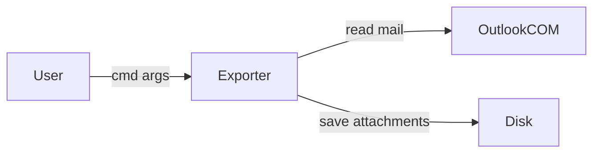

# Docs — Outlook Exporter

Two modes: COM and Graph — keep README as source of truth.

## Diagram

```mermaid
flowchart LR
  User[User] -->|cmd args| Exporter[Exporter]
  Exporter[Exporter] -->|read mail| OutlookCOM[OutlookCOM]
  Exporter[Exporter] -->|save attachments| Disk[Disk]
```
